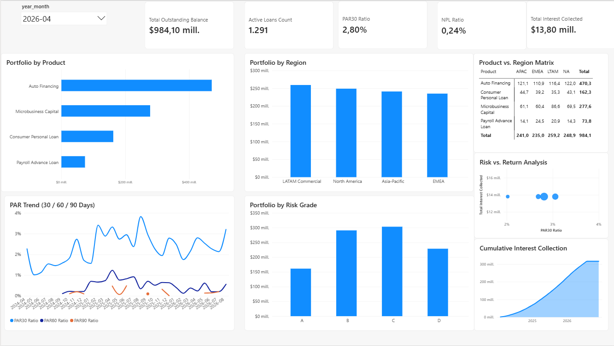

# Credit Risk & Loan Portfolio Analytics

An end-to-end data analytics and credit risk pipeline featuring data modeling in DuckDB/SQL, automated ETL workflows, and an executive Power BI portfolio dashboard.

---

## Executive Summary & Business Insights (April 2026 Snapshot)

* **Total Outstanding Balance:** **$984.10M** across **1,291 active loans**.
* **Portfolio Concentration:** **Auto Financing** represents the largest single lending product exposure (\~$470.3M), followed by **Microbusiness Capital** (\~$277.6M).
* **Regional Distribution:** Credit deployment is balanced across **LATAM Commercial** ($259.2M), **North America** ($248.9M), **APAC** ($241.0M), and **EMEA** ($235.0M).
* **Credit Quality & Delinquency:**
  * **PAR30 Ratio:** **2.80%**
  * **NPL Ratio:** **0.24%**
  * Bulk of risk exposure resides in Risk Grades **B** and **C** (\~$290M and \~$305M respectively), reflecting a controlled credit expansion profile.
* **Revenue Realization:** Monthly interest collected stands at **$13.80M**, with **Cumulative Interest Collection** accelerating smoothly toward **$300M+** across the multi-year cycle.

# Credit Risk & Loan Portfolio Analytics Mart

End-to-end automated credit risk and loan portfolio analytics pipeline implementing a Kimball dimensional star schema, automated SQL data quality validation with DuckDB, CI/CD integration via GitHub Actions, and semantic modeling for Power BI (PBIP/TMDL).

## 1. Architecture Overview┌──────────────┐
              │   dim_date   │
              └──────┬───────┘
                     │
┌──────────────┐         │ 1:N         ┌─────────────┐
│ dim_customer ├─────────┼─────────────┤ dim_product │
└──────┬───────┘         │             └──────┬──────┘
│ 1:N             │                    │ 1:N
│          ┌──────┴──────┐             │
└──────────┤   dim_loan  ├─────────────┘
└──────┬──────┘
│ 1:N
┌─────────────────┴─────────────────┐
│                                   │
┌──────┴─────────────────────┐   ┌─────────┴───────────────┐
│ fct_loan_monthly_snapshot  │   │   fct_daily_repayment   │
└────────────────────────────┘   └─────────────────────────┘

* **Storage & Engine:** Synthetic data generation using Python (pandas, 
umpy), loaded and tested locally in **DuckDB**.
* **Governance & QA:** SQL test suite (sql/02_data_quality_tests.sql) verifying foreign key integrity, non-negative loan balances, credit score boundaries (300-850), and DPD consistency.
* **CI/CD:** Automated pipeline in .github/workflows/ci.yml executing tests on push and pull requests to main.
* **BI Semantic Layer:** Microsoft Power BI Project (.pbip) format with Tabular Model Definition Language (.tmdl) files and DAX risk measures.

---

## 2. Key DAX Measures

* **Portfolio at Risk (PAR 30, 60, 90):**
  feat: configure Power BI report definition and pages in TMDL\text{PAR 30 Ratio} = \frac{\sum \text{Outstanding Principal } (\text{DPD} > 30)}{\sum \text{Outstanding Principal}}feat: configure Power BI report definition and pages in TMDL
* **Non-Performing Loan (NPL) Ratio:**
  feat: configure Power BI report definition and pages in TMDL\text{NPL Ratio} = \frac{\sum \text{Outstanding Principal } (\text{DPD} \ge 90)}{\sum \text{Outstanding Principal}}feat: configure Power BI report definition and pages in TMDL
* **Vintage Analysis Curve:**
  feat: configure Power BI report definition and pages in TMDL\text{Cumulative Default Rate} = \frac{\text{NPL Amount at MOB } t}{\text{Original Originated Principal of Cohort}}feat: configure Power BI report definition and pages in TMDL

---

## 3. Project Structure

credit-risk-loan-analytics/
├── .github/workflows/
│   └── ci.yml
├── CreditRiskAnalytics.Dataset/
│   ├── definition.pbism
│   └── definition/
│       ├── database.tmdl
│       ├── model.tmdl
│       └── tables/
│           ├── dim_customer.tmdl
│           ├── dim_date.tmdl
│           ├── dim_loan.tmdl
│           ├── dim_product.tmdl
│           ├── fct_daily_repayment.tmdl
│           └── fct_loan_monthly_snapshot.tmdl
├── CreditRiskAnalytics.Report/
│   ├── definition.pbir
│   └── definition/
│       └── report.tmdl
├── CreditRiskAnalytics.pbip
├── docs/
│   └── data_dictionary.md
├── scripts/
│   ├── generate_loan_portfolio_data.py
│   └── run_quality_checks.py
├── sql/
│   ├── 01_schema_ddl.sql
│   └── 02_data_quality_tests.sql
├── .gitattributes
├── .gitignore
└── README.md

---

## 4. Execution & Validation

1. **Generate data:**
   \\\ash
   python scripts/generate_loan_portfolio_data.py
   \\\
2. **Run Quality Tests:**
   \\\ash
   python scripts/run_quality_checks.py
   \\\
3. **Open BI Project:**
   Open \CreditRiskAnalytics.pbip\ directly in Power BI Desktop (requires PBIP feature enabled).